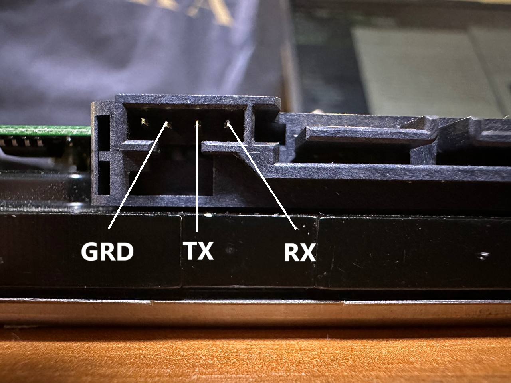
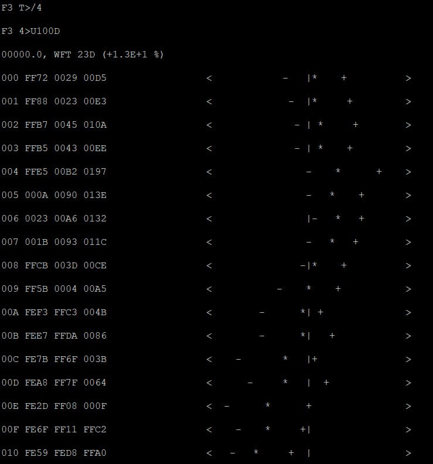
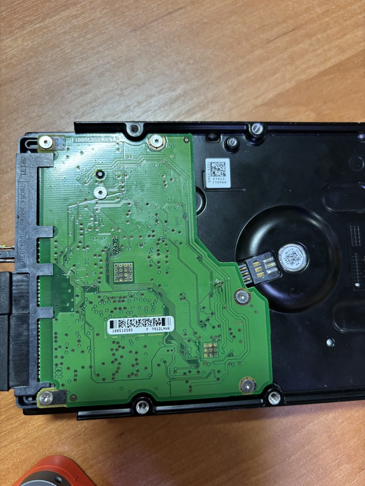
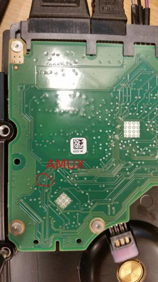
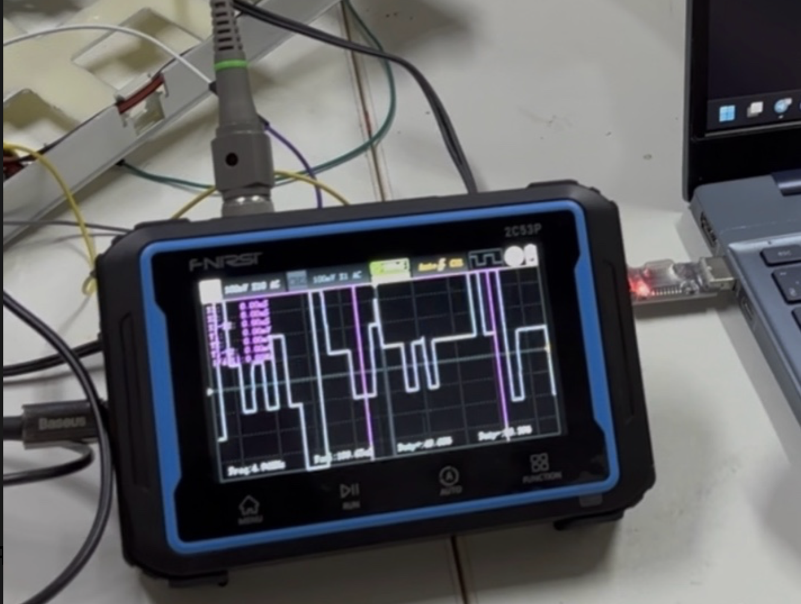

# HDD Microphone project

For this project we wanted to be able to extract sound played in the room from the HDD.

It can be done using PES (Position Error Signal), it is a signal in HDD that tells the controller if the head reading data moved and how much, but geting PES is not so easy.

There are two ways to try to get it using software or locating the AMUX pin on the board of the drive and reading PES from it. Firslty we decided to do it using software as it seamed easier. If only we knew what was waiting for us.

So let's dive in our process and how we were able to get PES:

Firstly we took a Seagate Baracuda 7200.11 1TB drive (.11 is the generation of the drive it will come handy later in our journey) as they have the F3 terminal to which we can connect using UART for debugging, and we can do a lot of debuging using it.



_Figure: Diagnostic UART / F3 terminal on the Seagate PCB used for debugging and PES output._

Then after searching the web we found two different documentations for this terminal.

Firstly we tried command from the first documentation:

```bash
Px,y,z
```

But it didn't work, and we understood that this documentation is probably not entirely correct so from onwards on we decided to use the second one.

After searching through the documentation we found a intresting command:

Level 4 'U': Rev 0011.0000, Overlay, Servo Batch Test sub commands, U[SubCmd],[SubCmdParm0],[SubCmdParm1],[SubCmdParm2]

We tried to run:

```bash
U100D
```

And it actually worked and we got this output:



But our happines was short lived as we discovered that even though this command returns PES it returns the values on frequency of 50Hz which is about 50 samples per second, while to recreate the sound we need to have something closer to 40kHz and to turn the values to the needed for is imposible.

And here we go again, we needed to find something new, so we decided to try to do it using AMUX pin.

Firslty we found a command **e** which enables PES output:

Level 4 'e': Rev 0011.0000, Overlay, Enable / Disable PES Output, e[PesLeftShiftCnt],[DisablePesOut]

For this we took the oscilloscope, and tried to find it. We needed to find a pin with 26,4kHz as we have HDD with 7200 RPM or 120 RPS and 220 servosectors which we were able to get using the **f0** command.

Then started the boring part we checked basically every pin and couldn't get anything that would be suitable. We found a few pins with correct frequency they still had the same results after we tried to turn of PES output using **e** command. So we went reading again and after checking the similar works, we found that everybody was using the Seagate Baracuda 7200.12 1TB drive and we had the same one but one generation behind. So we decided to buy the drive of 12 generation as from forums and papers we already knew where AMUX pin was.



_Figure: Seagate Baracuda 7200.11 1TB board._



_Figure: Location of AMUX pin on Seagate Baracuda 7200.12 1TB._


After getting the correct drive we tried to do the same but didn't get any results, at this point we were frustrated and were not understanding why it doesn't work, and after some discussions decided to check the **e** command as we found before **e0** turned PES output on and **e1** turned it off. But after some tries and reading we discovered that ex (x is some number) turns on pes output with a certain resolution 0 - smallest FF - largest, and ex,y or anything after the comma turns off PES output, with this new information we tried to do this again and for our happines it worked, and we were able to see the PES signal:



Now, having found it, we need to read it, there are two ways, we can solder to the AMUX pin, then connect it to ADC (Analog Digital converter), and get it from there, but as we did not have an ADC w tried to do it through oscilloscope, as it can save the wavefrom, so we connected eveything to the oscilloscope, played a song, and saved 10 seconds of the waveform.

After that we wrote the script, that would transform this csv into audiofile. To run and see the results:

```
python3 transform.py data/SDS814X_HD_CSV_C1_3.csv
```

And from that we finally were able to get the audio.